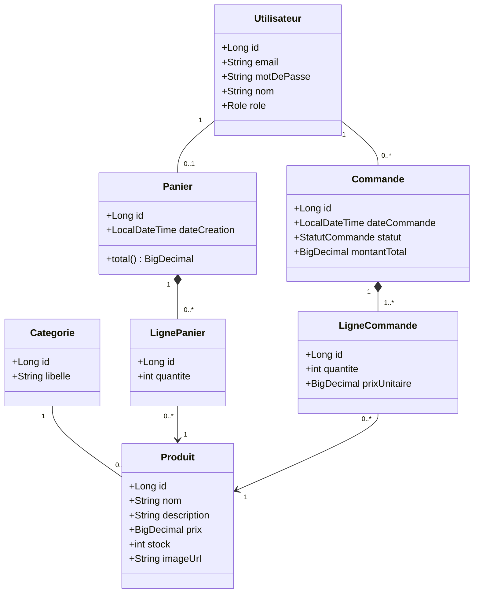

# Projet fil rouge — Site e-commerce « MiniShop »
### Canevas d'exercice — Spring Boot + Angular — 5 jours — équipes de 3 à 4 stagiaires

---

## 1. Cadrage

| Élément | Valeur |
|---|---|
| Durée | 5 jours (≈ 35 h) |
| Organisation | Équipes de 3 à 4 |
| Niveau | Débutants Java / Spring Boot / Angular |
| Stack imposée | Java 21, Spring Boot 3.x, Maven, Angular 17+ (standalone components), H2 ou PostgreSQL |
| Restitution | Démo 15 min + revue des livrables de conception, J5 après-midi |

### Rôles dans l'équipe (tournants, pas figés)

- **Product Owner (PO)** : garant du backlog, arbitre le périmètre, prépare la démo.
- **Référent back** : modèle de données, API REST, cohérence du contrat.
- **Référent front** : arborescence Angular, routing, intégration API.
- **Référent qualité/intégration** : Git, conventions, tests, README, exécutabilité du projet.

> Chaque stagiaire code **à la fois du back et du front**. Le rôle est une responsabilité de cohérence, pas un monopole sur les tâches.

---

## 2. Objectifs pédagogiques

À l'issue du projet, le stagiaire doit être capable de :

**Conception**
1. Traduire un besoin métier en user stories avec critères d'acceptation.
2. Produire un diagramme de cas d'utilisation et un diagramme de classes métier cohérents.
3. Dériver un modèle relationnel à partir du modèle objet.
4. Spécifier un contrat d'API REST (OpenAPI) **avant** d'écrire le code.
5. Maquetter les écrans clés et définir la navigation.

**Réalisation back**
6. Structurer une application Spring Boot en couches (controller / service / repository).
7. Mapper un modèle objet avec JPA (relations `@OneToMany`, `@ManyToOne`).
8. Exposer une API REST respectant le contrat, avec DTO et gestion d'erreurs.
9. Sécuriser des endpoints avec Spring Security + JWT (version simplifiée).

**Réalisation front**
10. Structurer une application Angular : composants, services, routing, guards.
11. Consommer une API REST avec `HttpClient` et gérer l'état (panier).
12. Construire des formulaires réactifs avec validation.

**Transverse**
13. Travailler en équipe avec Git (branches, PR, revue de code).
14. Écrire des tests unitaires simples et documenter le projet.

---

## 3. Énoncé remis aux stagiaires

> **Contexte.** La société *MiniShop* souhaite vendre en ligne un catalogue de produits. Elle veut un site permettant à un visiteur de parcourir le catalogue, à un client de constituer un panier et de passer commande, et à un administrateur de gérer les produits et de suivre les commandes.
>
> **Votre mission.** Concevoir puis réaliser l'application. La phase de conception est notée au même titre que le code : aucune ligne de code métier ne doit être écrite avant validation de votre dossier de conception par le formateur (fin J1).

### Règles de gestion (à respecter et à retrouver dans le modèle)

- **RG1** — Un produit appartient à une et une seule catégorie ; une catégorie contient 0..n produits.
- **RG2** — Un produit possède un stock ; il ne peut être commandé au-delà du stock disponible.
- **RG3** — Un client possède au plus un panier actif à la fois.
- **RG4** — Le panier contient des lignes ; une ligne référence un produit et une quantité ≥ 1. Ajouter deux fois le même produit incrémente la ligne existante.
- **RG5** — À la validation, le panier devient une commande : le **prix unitaire est figé** dans la ligne de commande (une hausse de prix ultérieure ne doit pas modifier une commande passée).
- **RG6** — La validation décrémente le stock. Si le stock est insuffisant, la commande est refusée intégralement.
- **RG7** — Une commande a un statut : `EN_ATTENTE` → `PAYEE` → `EXPEDIEE` → `LIVREE`, ou `ANNULEE`. Les transitions arrière sont interdites.
- **RG8** — Un utilisateur a un rôle : `CLIENT` ou `ADMIN`. Seul l'ADMIN gère le catalogue et change le statut d'une commande.
- **RG9** — Un client ne peut consulter que ses propres commandes.

> Le paiement n'est **pas** à implémenter : un bouton « Payer » qui passe la commande en `PAYEE` suffit.

---

## 4. Périmètre fonctionnel

### 4.1 MVP — obligatoire (noté)

| # | Fonctionnalité | Acteur |
|---|---|---|
| F1 | Inscription et connexion (JWT) | Visiteur |
| F2 | Lister le catalogue avec pagination | Tous |
| F3 | Filtrer par catégorie et rechercher par nom | Tous |
| F4 | Consulter la fiche détaillée d'un produit | Tous |
| F5 | Ajouter / modifier la quantité / retirer un article du panier | Client |
| F6 | Consulter le panier avec total calculé | Client |
| F7 | Valider le panier → création de la commande | Client |
| F8 | Consulter l'historique de ses commandes et le détail d'une commande | Client |
| F9 | CRUD produits et catégories | Admin |
| F10 | Lister toutes les commandes et changer leur statut | Admin |

### 4.2 Bonus — si l'équipe est en avance (points supplémentaires)

- Upload d'image produit.
- Tri (prix croissant/décroissant, nouveautés).
- Panier persisté côté serveur pour un utilisateur connecté (au lieu du `localStorage`).
- Notes et avis produits.
- Dockerisation (`docker-compose` : back + front + PostgreSQL).
- Documentation Swagger UI générée et publiée.
- Tableau de bord admin avec chiffres clés (CA, top produits).

### 4.3 Hors périmètre (à annoncer explicitement)

Paiement réel, livraison/transporteurs, promotions et codes promo, multi-devises, gestion de TVA complexe, e-mails transactionnels, back-office multi-boutique.

---

## 5. Phase de conception (J1 — livrable bloquant)

> **Règle du jeu** : à 17 h le J1, chaque équipe présente son dossier de conception en 10 minutes au formateur. Tant qu'il n'est pas validé, l'équipe ne passe pas au code. C'est volontaire : l'objectif est de faire vivre le coût d'une conception bâclée.

### 5.1 Livrable A — Backlog en user stories

Format imposé :

> **En tant que** `<acteur>`, **je veux** `<action>` **afin de** `<bénéfice>`.
>
> **Critères d'acceptation** (Given / When / Then)
> - Étant donné … quand … alors …
>
> **Priorité** : MUST / SHOULD / COULD — **Estimation** : S / M / L

Exemple fourni comme modèle :

> **US-07 — Valider mon panier**
> En tant que **client connecté**, je veux **valider mon panier** afin de **passer commande**.
> - Étant donné un panier de 3 articles tous en stock, quand je valide, alors une commande au statut `EN_ATTENTE` est créée avec les 3 lignes et le panier est vidé.
> - Étant donné un panier contenant un article dont le stock est insuffisant, quand je valide, alors la commande est refusée, un message indique le produit fautif et **aucun** stock n'est décrémenté.
> - Étant donné un panier vide, quand je valide, alors l'action est refusée.
> Priorité : MUST — Estimation : L

**Attendu** : 10 à 14 user stories couvrant F1 → F10, priorisées, avec au moins 2 critères d'acceptation chacune.

### 5.2 Livrable B — Diagramme de cas d'utilisation

Acteurs : **Visiteur**, **Client** (hérite de Visiteur), **Administrateur**.
Attendu : les cas regroupés en paquets (Catalogue, Panier & Commande, Administration), les relations `<<include>>` (ex. *Valider le panier* include *S'authentifier*) et `<<extend>>` correctement employées.

### 5.3 Livrable C — Diagramme de classes métier

Attendu : classes, attributs typés, multiplicités, navigabilité, agrégation/composition justifiées.

*Corrigé indicatif formateur :*



**Points de vigilance à faire découvrir** (ne pas les donner d'emblée) :
- Pourquoi `prixUnitaire` est-il dupliqué dans `LigneCommande` alors que `Produit` a déjà un prix ? → RG5.
- Pourquoi `LignePanier` n'a-t-elle pas de prix ? → le panier reflète le prix courant.
- Composition vs association : supprimer une commande supprime ses lignes, mais **pas** les produits.

### 5.4 Livrable D — Deux diagrammes de séquence

Obligatoires :
1. **Ajout au panier** (front → API → service → repository → BDD), cas nominal + cas « stock insuffisant ».
2. **Validation de commande**, en montrant explicitement la vérification de stock, la création de la commande, la décrémentation et le vidage du panier.

Attendu : les frontières Angular / Spring et l'endpoint appelé doivent apparaître.

### 5.5 Livrable E — Modèle relationnel (MPD)

Dérivé du diagramme de classes : tables, clés primaires, clés étrangères, contraintes (`NOT NULL`, `UNIQUE` sur `email`, `CHECK (quantite >= 1)`, `CHECK (stock >= 0)`).

```
utilisateur(id, email UNIQUE, mot_de_passe, nom, role)
categorie(id, libelle UNIQUE)
produit(id, nom, description, prix, stock, image_url, #categorie_id)
panier(id, date_creation, #utilisateur_id UNIQUE)
ligne_panier(id, quantite, #panier_id, #produit_id)   -- UNIQUE(panier_id, produit_id)
commande(id, date_commande, statut, montant_total, #utilisateur_id)
ligne_commande(id, quantite, prix_unitaire, #commande_id, #produit_id)
```

Livrer aussi le jeu de données de démo (`data.sql`) : 3 catégories, 15 produits, 1 admin, 2 clients.

### 5.6 Livrable F — Contrat d'API (OpenAPI)

Rédigé **avant** le code, en `openapi.yaml`, et validé collectivement : c'est le contrat entre les binômes back et front, qui pourront ensuite travailler en parallèle.

| Méthode | Chemin | Rôle | Corps / Réponse |
|---|---|---|---|
| POST | `/api/auth/register` | public | `{email, motDePasse, nom}` → 201 |
| POST | `/api/auth/login` | public | `{email, motDePasse}` → `{token, role}` |
| GET | `/api/produits?page=&size=&categorieId=&q=` | public | page de `ProduitDto` |
| GET | `/api/produits/{id}` | public | `ProduitDto` ou 404 |
| POST/PUT/DELETE | `/api/produits[/{id}]` | ADMIN | CRUD |
| GET | `/api/categories` | public | liste |
| GET | `/api/panier` | CLIENT | `PanierDto` (lignes + total) |
| POST | `/api/panier/lignes` | CLIENT | `{produitId, quantite}` |
| PUT | `/api/panier/lignes/{id}` | CLIENT | `{quantite}` |
| DELETE | `/api/panier/lignes/{id}` | CLIENT | 204 |
| POST | `/api/commandes` | CLIENT | valide le panier → `CommandeDto` (201) |
| GET | `/api/commandes/me` | CLIENT | ses commandes |
| GET | `/api/commandes/{id}` | CLIENT/ADMIN | 403 si ce n'est pas la sienne |
| GET | `/api/commandes` | ADMIN | toutes |
| PATCH | `/api/commandes/{id}/statut` | ADMIN | `{statut}` |

**Conventions imposées** (à discuter avec eux, pas à imposer sans explication) :
- Noms de ressources au pluriel, pas de verbe dans l'URL.
- Codes HTTP : 200 / 201 / 204 / 400 / 401 / 403 / 404 / 409 (conflit de stock).
- Format d'erreur unique :
  ```json
  { "timestamp": "...", "status": 409, "code": "STOCK_INSUFFISANT",
    "message": "Stock insuffisant pour le produit 'Clavier' (demandé 3, disponible 1)",
    "path": "/api/commandes" }
  ```
- **Jamais** d'entité JPA exposée directement : toujours un DTO.

### 5.7 Livrable G — Maquettes et navigation

7 écrans à maquetter (papier, Figma, Excalidraw — peu importe l'outil, l'important est la structure) :

1. Accueil / catalogue (grille + filtres + pagination)
2. Fiche produit
3. Panier
4. Confirmation de commande
5. Connexion / inscription
6. Mes commandes + détail
7. Admin : liste produits + formulaire, liste commandes

Plus un **plan de navigation** (arbre des routes) reliant les écrans, en indiquant les routes protégées.

### 5.8 Grille de validation du dossier de conception (J1, 17 h)

- [ ] Les 10 fonctionnalités MVP sont couvertes par des user stories priorisées.
- [ ] Le diagramme de classes respecte RG1 à RG9.
- [ ] La décision sur `prixUnitaire` figé est présente et justifiée.
- [ ] Le MPD est cohérent avec le diagramme de classes (aucune classe orpheline).
- [ ] Le contrat d'API couvre chaque user story MUST.
- [ ] Les écrans couvrent tous les parcours ; aucune route « orpheline ».
- [ ] L'équipe sait dire quelle US sera livrée en premier et pourquoi.

---

## 6. Planning jour par jour

### J1 — Conception (aucun code métier)

| Créneau | Activité |
|---|---|
| 9 h – 9 h 45 | Présentation du sujet, des règles de gestion, constitution des équipes, distribution des rôles |
| 9 h 45 – 10 h 30 | **Atelier guidé** : rédaction collective de 2 user stories modèles au tableau |
| 10 h 30 – 12 h 30 | Backlog complet + cas d'utilisation (livrables A et B) |
| 13 h 30 – 15 h 00 | Diagramme de classes + MPD (livrables C et E) |
| 15 h 00 – 16 h 00 | Diagrammes de séquence + contrat OpenAPI (livrables D et F) |
| 16 h 00 – 17 h 00 | Maquettes et plan de navigation (livrable G) |
| 17 h 00 – 18 h 00 | **Revue de conception** avec le formateur — validation ou corrections |

> Prévoir 30 min en fin de matinée pour un point technique flash : *« lire un diagramme de classes et le traduire en entités JPA »*.

### J2 — Fondations back

- Génération du projet (Spring Initializr : Web, JPA, Validation, Security, Lombok, H2).
- Arborescence en couches, entités JPA + relations, repositories.
- `data.sql` de démo, vérification via la console H2.
- Endpoints publics catalogue : `GET /api/produits` (pagination, filtre, recherche), `GET /api/produits/{id}`, `GET /api/categories`.
- DTO + mapper, `@RestControllerAdvice` pour la gestion d'erreurs, CORS.
- **Jalon J2** : le catalogue répond correctement dans Postman / Swagger UI, conformément au contrat.

### J3 — Fondations front + sécurité back

Sous-équipe back :
- Authentification : `register`, `login`, JWT, filtre de sécurité, `@PreAuthorize` sur les routes ADMIN.
- CRUD produits et catégories.

Sous-équipe front :
- `ng new`, structure des dossiers, environnements, service `ApiService`.
- Modèles TypeScript **dérivés du contrat OpenAPI**.
- Pages catalogue et fiche produit, routing, composants réutilisables (`ProductCard`).

- **Jalon J3** : on peut naviguer dans le catalogue depuis Angular, données réelles issues de l'API.

### J4 — Cœur métier : panier et commande

- Back : logique panier, validation de commande (contrôle de stock, décrémentation, prix figé, transaction), historique des commandes, changement de statut admin.
- Front : service `PanierService` (état + persistance), page panier, tunnel de commande, page « mes commandes », intercepteur HTTP JWT, `AuthGuard` et `AdminGuard`, formulaires réactifs avec validation.
- **Jalon J4** : parcours complet *connexion → catalogue → panier → commande → historique* fonctionnel de bout en bout.

### J5 — Finition, tests, restitution

| Créneau | Activité |
|---|---|
| 9 h – 11 h 30 | Écran d'administration, gestion des erreurs côté UI, états de chargement et messages vides |
| 11 h 30 – 12 h 30 | Tests : 3 tests unitaires de service (JUnit + Mockito) dont le cas « stock insuffisant », 1 test de contrôleur (MockMvc), 1 test Angular de service |
| 13 h 30 – 15 h 00 | README, nettoyage du code, **mise à jour du dossier de conception** pour refléter l'implémentation réelle, préparation du scénario de démo |
| 15 h 00 – 17 h 00 | **Soutenances** : 15 min de démo + 10 min de questions par équipe |
| 17 h 00 – 18 h 00 | Débriefing collectif : écarts conception / réalisation, ce qu'on referait autrement |

---

## 7. Architecture technique de référence

### 7.1 Back — arborescence attendue

```
src/main/java/com/formation/minishop/
├── MinishopApplication.java
├── config/          SecurityConfig, CorsConfig, OpenApiConfig
├── security/        JwtService, JwtAuthFilter, UserDetailsServiceImpl
├── entity/          Utilisateur, Produit, Categorie, Panier, LignePanier,
│                    Commande, LigneCommande, Role, StatutCommande
├── repository/      *Repository extends JpaRepository
├── dto/             ProduitDto, PanierDto, CommandeDto, requêtes...
├── mapper/          ProduitMapper, CommandeMapper
├── service/         ProduitService, PanierService, CommandeService, AuthService
├── controller/      ProduitController, PanierController, CommandeController, AuthController
└── exception/       ResourceNotFoundException, StockInsuffisantException,
                     GlobalExceptionHandler
```

**Règles non négociables** à afficher au mur :
1. Un contrôleur ne contient **aucune** logique métier ; il délègue au service.
2. Un contrôleur ne renvoie **jamais** une entité JPA, uniquement des DTO.
3. La logique métier vit dans le service ; les méthodes qui écrivent sont `@Transactional`.
4. Une exception métier = une classe dédiée, traduite en code HTTP par le handler global.

### 7.2 Front — arborescence attendue

```
src/app/
├── core/
│   ├── services/     auth.service.ts, produit.service.ts,
│   │                 panier.service.ts, commande.service.ts
│   ├── interceptors/ jwt.interceptor.ts, error.interceptor.ts
│   ├── guards/       auth.guard.ts, admin.guard.ts
│   └── models/       produit.model.ts, panier.model.ts, commande.model.ts
├── shared/
│   └── components/   header, footer, product-card, loader, empty-state
├── features/
│   ├── catalogue/    catalogue-page, produit-detail-page
│   ├── panier/       panier-page
│   ├── commande/     tunnel-page, confirmation-page, mes-commandes-page
│   ├── auth/         login-page, register-page
│   └── admin/        produits-admin-page, produit-form, commandes-admin-page
└── app.routes.ts
```

### 7.3 Conventions Git

- Une branche par user story : `feat/US-07-validation-panier`.
- Commits en français ou anglais, mais **cohérents**, préfixés `feat:`, `fix:`, `docs:`, `test:`.
- Aucune fusion dans `main` sans relecture par un autre membre de l'équipe.
- `main` doit toujours démarrer : `mvn spring-boot:run` + `ng serve` sans erreur.

### 7.4 Definition of Done (une US est terminée si…)

- [ ] Le comportement correspond aux critères d'acceptation.
- [ ] L'API respecte le contrat OpenAPI (sinon le contrat a été mis à jour explicitement).
- [ ] Les cas d'erreur renvoient le bon code HTTP et un message lisible côté UI.
- [ ] Le code est relu et fusionné dans `main`.
- [ ] Aucun `System.out.println`, aucun code mort, aucun secret en dur.

---

## 8. Évaluation

### 8.1 Barème (100 points)

| Domaine | Critère | Pts |
|---|---|---|
| **Conception (35)** | Backlog : couverture, critères d'acceptation testables, priorisation | 8 |
| | Diagramme de cas d'utilisation : acteurs, relations correctes | 5 |
| | Diagramme de classes : multiplicités, respect des RG, choix justifiés | 12 |
| | MPD cohérent, contraintes d'intégrité | 5 |
| | Diagrammes de séquence lisibles et corrects | 5 |
| **Réalisation back (25)** | Architecture en couches respectée, DTO, pas de logique dans les contrôleurs | 8 |
| | Modèle JPA correct (relations, cascades, fetch) | 6 |
| | API conforme au contrat, codes HTTP, gestion d'erreurs | 6 |
| | Sécurité JWT et contrôle des rôles fonctionnels | 5 |
| **Réalisation front (20)** | Structure Angular, découpage en composants, services | 6 |
| | Consommation de l'API, gestion des états (chargement, vide, erreur) | 6 |
| | Formulaires réactifs et validation | 4 |
| | Routing, guards, expérience de navigation | 4 |
| **Qualité (10)** | Git : branches, commits, revues | 4 |
| | Tests présents et pertinents | 3 |
| | README permettant de lancer le projet sans aide | 3 |
| **Restitution (10)** | Démo maîtrisée, écarts conception/réalisation assumés et expliqués | 6 |
| | Réponses aux questions, connaissance du code par **tous** les membres | 4 |
| Bonus | Fonctionnalités de la section 4.2 | +10 max |

### 8.2 Questions de soutenance (piocher 3 par équipe)

1. Montrez-moi dans le code où la règle RG5 est appliquée. Que se passe-t-il si je change le prix d'un produit déjà commandé ?
2. Que se passe-t-il si deux clients valident en même temps la dernière unité en stock ? (question ouverte : on attend une prise de conscience, pas forcément une solution)
3. Pourquoi avoir mis cette méthode dans le service plutôt que dans le contrôleur ?
4. Où est stocké le JWT côté Angular, et quels sont les risques de ce choix ?
5. Que fait `@Transactional` sur votre méthode de validation de commande ? Et si on l'enlève ?
6. Vous avez un DTO et une entité qui se ressemblent beaucoup : pourquoi ne pas exposer l'entité ?
7. Montrez un endroit où votre implémentation s'écarte de votre conception du J1. Pourquoi ?
8. Comment votre front réagit-il si l'API renvoie une 500 ?

### 8.3 Auto-évaluation d'équipe (à rendre avec le projet, 10 lignes)

- Ce qui a le mieux fonctionné dans notre organisation.
- Ce qui nous a coûté le plus de temps, et pourquoi.
- Ce que nous ferions différemment lors de la phase de conception.

---

## 9. Guide d'encadrement

### 9.1 Points de blocage classiques chez les débutants

| Symptôme | Cause fréquente | Intervention |
|---|---|---|
| Erreur CORS dès le premier appel front | Pas de configuration CORS côté Spring | Prévoir un point flash collectif au J3 matin |
| `StackOverflowError` / JSON infini | Relation bidirectionnelle sérialisée | Occasion parfaite d'introduire les DTO : ne pas donner `@JsonIgnore` comme solution |
| `LazyInitializationException` | Accès à une collection hors transaction | Expliquer fetch LAZY/EAGER et le mapping dans le service |
| Le panier se vide au rafraîchissement | État en mémoire uniquement | Introduire `localStorage`, puis discuter du panier serveur |
| 401 sur tous les appels | Intercepteur JWT non enregistré | Faire lire les en-têtes dans l'onglet Réseau |
| Conflits Git à répétition | Tout le monde sur `main` | Recadrer les branches dès le J2 |
| Une seule personne code, les autres regardent | Répartition mal faite | Rotation imposée, revue de code croisée obligatoire |

### 9.2 Rythme d'encadrement

- **Stand-up de 10 min chaque matin** par équipe : fait hier / aujourd'hui / blocages.
- **Point de contrôle à 16 h** au J2, J3, J4 : chaque équipe montre ce qui tourne, pas ce qui est écrit.
- **Règle des 20 minutes** : bloqué plus de 20 min ? On demande à l'équipe, puis au formateur.
- Ne jamais donner la solution directement : poser la question qui mène à l'erreur (lire le message d'exception à voix haute suffit souvent).

### 9.3 Kit à préparer avant le J1

- [ ] Dépôt Git modèle avec `.gitignore`, README type, `openapi.yaml` vide commenté.
- [ ] Postman/Bruno collection de référence correspondant au contrat.
- [ ] Environnements vérifiés : JDK 21, Maven, Node LTS, Angular CLI, IDE, Git.
- [ ] Un exemple complet de user story et un exemple de diagramme de classes (sujet différent : bibliothèque, pas e-commerce).
- [ ] `data.sql` de secours à distribuer si une équipe perd du temps sur le jeu de données.
- [ ] Slides des 4 points flash : DTO/JPA (J2), CORS + JWT (J3), état front (J4), tests (J5).

---

## 10. Variantes

- **Version courte (3 jours)** : conservez F1 à F8, supprimez l'administration (F9, F10) et la sécurité JWT (session simplifiée). La phase de conception passe à une demi-journée.
- **Version longue (10 jours)** : ajoutez les bonus, la dockerisation, un pipeline CI (GitHub Actions), un vrai sprint 2 avec réunion de rétrospective.
- **Variante sujet** : remplacer le e-commerce par une billetterie de spectacles ou une plateforme de location de matériel — le modèle (catalogue / réservation / stock) est structurellement identique, ce qui permet de réutiliser tout le canevas et évite le copier-coller de projets trouvés en ligne.

---

## 11. Annexe — Documents à rendre

À déposer dans le dépôt Git, dossier `/docs` :

```
docs/
├── 01-backlog.md              user stories + critères d'acceptation
├── 02-cas-utilisation.png
├── 03-diagramme-classes.png
├── 04-sequences.png
├── 05-mpd.md                  ou .png
├── 06-openapi.yaml
├── 07-maquettes/              images + plan de navigation
└── 08-auto-evaluation.md
README.md                      installation, lancement, comptes de démo
```

